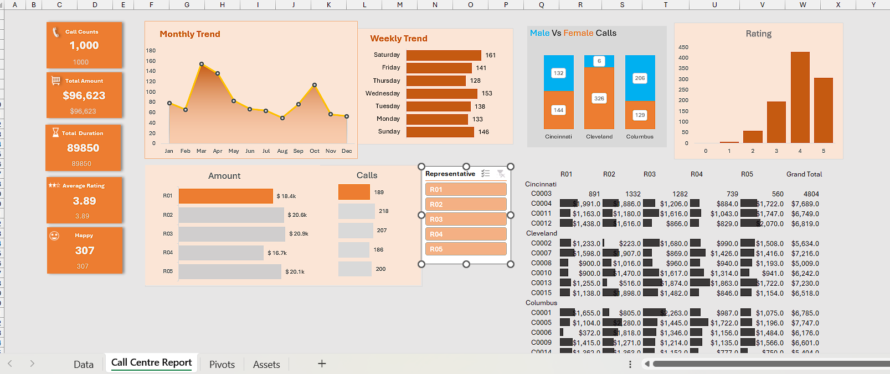

# 🎯Call Centre Dashboard

- Analyze call center performance metrics
- Track trends across time (monthly & weekly)
- Evaluate customer satisfaction using ratings
- Identify operational patterns across call types
- Build an interactive and user-friendly dashboard

📈 Visual Insights
- Monthly Trend Analysis → Identifies peak and low performance periods
- Weekly Trend Analysis → Highlights busiest days of the week
- Call Type Distribution → Inbound vs Outbound vs Internal calls
- Gender-Based Analysis → Male vs Female call distribution
- Customer Ratings → Service quality evaluation
- Representative Performance → Calls handled & revenue generated

💡 Key Insights
- Mid-year months show higher call volumes and performance
- Customer ratings are mostly between 3–5, indicating moderate satisfaction
- Certain representatives contribute significantly to revenue
- Weekdays (especially mid-week) show higher call activity
